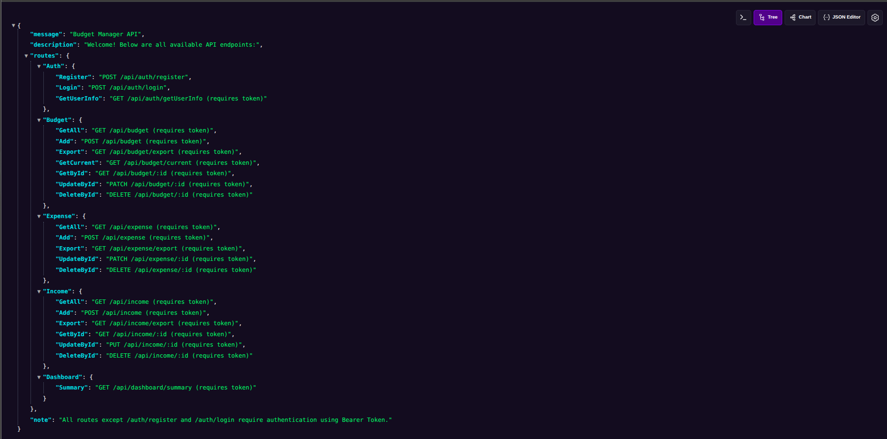

# 📦 Budget Manager API

A minimal REST API for managing personal budgets, incomes, and expenses. Built with **Node.js**, **Express**, and **MongoDB**.

---

## 🖼️ Preview

Here’s how the API root looks:



---

## 🚀 Features

- User Authentication (JWT)
- Budget, Income, Expense management
- Dashboard summary with insights
- Excel export for reports
- Pagination & Filtering support
- API-first design ready for frontend

---

## 📡 API Endpoints

### 🧑‍💼 Auth

- `POST /api/auth/register` – Register user
- `POST /api/auth/login` – Login and get JWT
- `GET /api/auth/getUserInfo` – Get current user (requires token)

### 💰 Budget

- `GET /api/budget?page=1&limit=10` – Get paginated budgets (requires token)
- `POST /api/budget` – Add budget (requires token)
- `GET /api/budget/export` – Export budgets (requires token)
- `GET /api/budget/current` – Get current month’s budget (requires token)
- `GET /api/budget/:id` – Get budget by ID (requires token)
- `PATCH /api/budget/:id` – Update budget by ID (requires token)
- `DELETE /api/budget/:id` – Delete budget by ID (requires token)

### 📥 Income

- `GET /api/income?page=1&limit=10` – Get paginated incomes (requires token)
- `POST /api/income` – Add income (requires token)
- `GET /api/income/export` – Export incomes (requires token)
- `GET /api/income/:id` – Get income by ID (requires token)
- `PUT /api/income/:id` – Update income by ID (requires token)
- `DELETE /api/income/:id` – Delete income by ID (requires token)

### 💸 Expense

- `GET /api/expense?page=1&limit=10` – Get paginated expenses (requires token)
- `POST /api/expense` – Add expense (requires token)
- `GET /api/expense/export` – Export expenses (requires token)
- `PATCH /api/expense/:id` – Update expense by ID (requires token)
- `DELETE /api/expense/:id` – Delete expense by ID (requires token)

### 📊 Dashboard

- `GET /api/dashboard/summary` – Get dashboard summary (requires token)

### 🏠 Home

- `GET /` – Lists all API routes

---

## 🔐 Authentication

Include JWT token in headers for protected routes:

```
Authorization: Bearer <token>
```

---

## 🛠 Tech Stack

- Node.js + Express
- MongoDB (Mongoose)
- JWT
- xlsx for Excel exports


